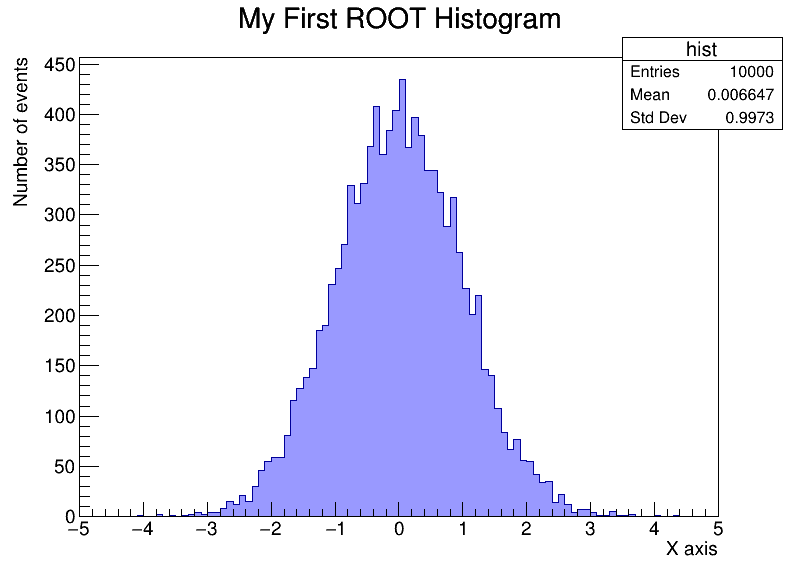

##**Інструкція: Налаштування SSH, клонування репозиторію та базові команди Git**

Інструкція  описує повний цикл: від генерації SSH-ключів для доступу до GitHub до створення файлу та його відправки у віддалений репозиторій.

Спочатку необхідно згенерувати SSH-ключ для безпечного підключення до GitHub за допомогою команди 
       ssh-keygen -t ed25519 -C "katerinasobatkevic@gmail.com"`
 Згенерований публічний ключ можна переглянути командою 
      cat ~/.ssh/id_ed25519.pub`
щоб потім скопіювати виведений текст та додати його в налаштування вашого акаунту GitHub (у розділ SSH and GPG keys). 

Далі створюється робоча папка за допомогою команди 
       mkdir root_intro
 і здійснюється перехід до неї через
       cd root_intro/
 Після успішного налаштування доступу можна клонувати віддалений репозиторій командою
       git clone git@github.com:kateriinna/root_training.git 
і відразу перейти в його директорію, використовуючи `
       cd root_training

Для створення або редагування файлів використовується консольний текстовий редактор: написавши
        nano hello.txt
ви зможете додати потрібний текст і зберегти його. Перевірити наявність створеного файлу, дату його зміни та вивести вміст прямо у термінал можна командами 
         ls -lt` та `cat hello.txt
Коли зміни у файлі остаточно внесені, їх потрібно зафіксувати в історії Git.
 Для цього спочатку перевіряється поточний стан репозиторію 
         git status,
 потім новий файл додається до індексу підготовки 
        git add hello.txt
після чого створюється коміт із описом виконаної роботи 
        git commit -m "почали вчити гіт"`
На завершення, щоб відправити збережені зміни з локальної машини на сервер GitHub, використовується команда 
        git push.
 Якщо в процесі роботи вам потрібно буде згадати, які саме команди ви вводили раніше, достатньо написати
        history

##**Інструкція: Створення гістограми в ROOT та завантаження на GitHub**

Інструкція описує процес створення макросу для побудови гістограми нормального розподілу у фреймворку ROOT та відправки результатів у віддалений репозиторій.

Для створення файлу-макросу використовується консольний текстовий редактор: написавши
       nano my_hist.C
ви зможете відкрити порожній файл.

У відкритий файл потрібно додати наступний код та зберегти його:
       void my_hist() {
           TCanvas *c1 = new TCanvas("c1", "My Canvas", 800, 600);
           TH1F *hist = new TH1F("hist", "My First ROOT Histogram;X axis;Number of events", 100, -5, 5);
           for (int i = 0; i < 10000; i++) {
               hist->Fill(gRandom->Gaus(0, 1));
           }
           hist->SetFillColor(kBlue-9);
           hist->Draw();
           c1->SaveAs("my_histogram.png");
       }

Щоб виконати створений макрос і одразу вийти з ROOT, використовується команда
       root -l -q my_hist.C
Після виконання цієї команди в папці з'явиться файл із зображенням my_histogram.png.

Щоб гістограма відображалася прямо на сторінці GitHub, її потрібно додати у файл README.md за допомогою такого синтаксису:
       

Коли всі файли створені та змінені, їх потрібно зафіксувати в історії Git.
Для цього спочатку вони додаються до індексу підготовки
       git add my_hist.C my_histogram.png README.md
після чого створюється коміт із описом виконаної роботи
       git commit -m "Додано макрос для створення гістограми"
На завершення, щоб відправити збережені зміни з локальної машини на сервер GitHub, використовується команда
       git push

